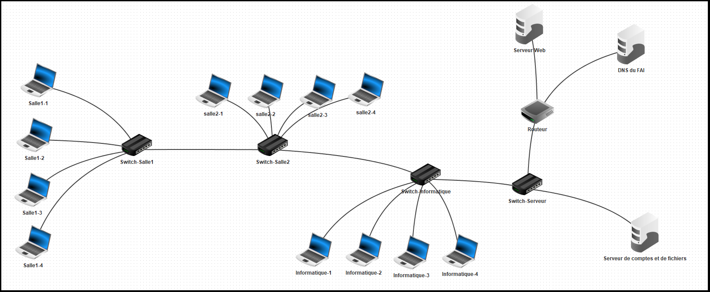
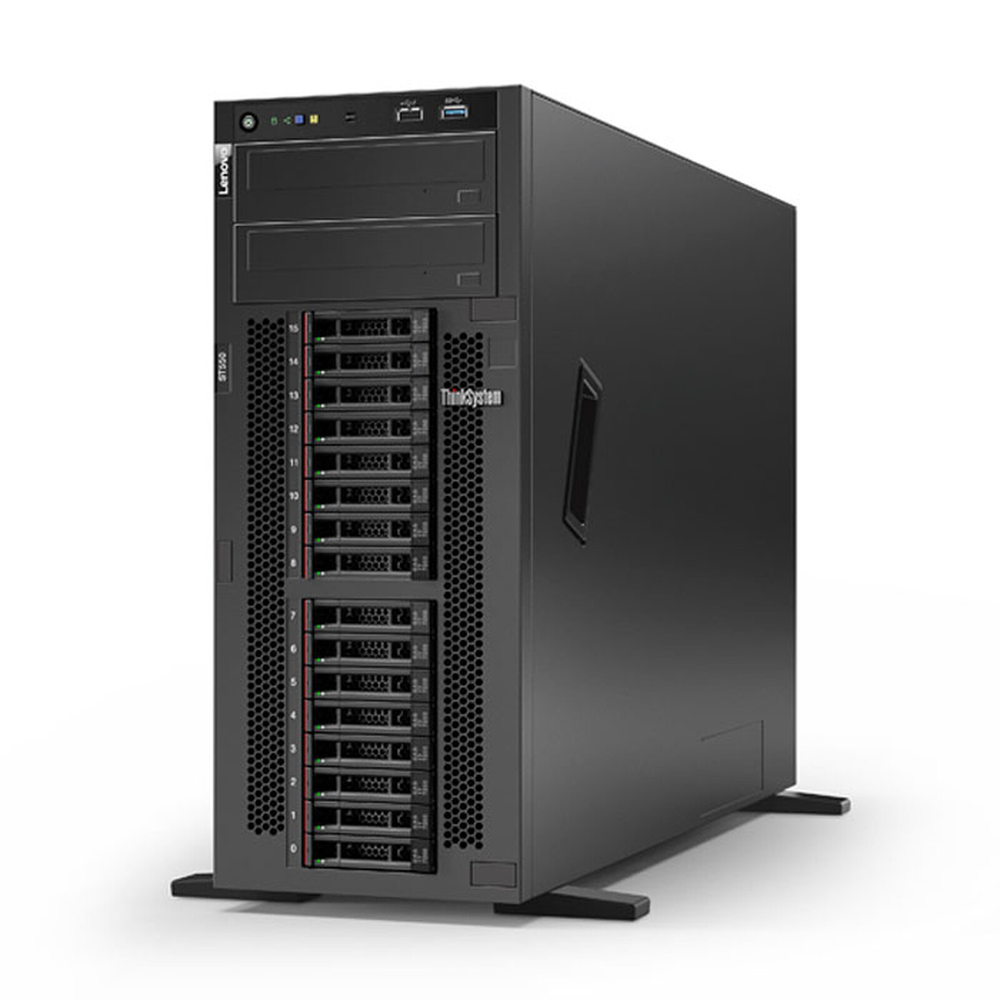
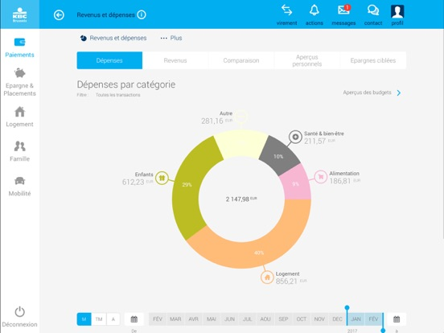

# Portfolio de Youla Mamadouba

Bienvenue sur mon portfolio. Ce site présente mes informations personnelles, mes compétences, mes projets réalisés et mes centres d'intérêt. 

## Contenu

- [Biographie](#biographie)
- [Compétences](#compétences)
- [Projets](#projets)
- [Contact](#contact)
- [Hobbies et Centres d'intérêt](#hobbies-et-centres-dintérêt)

## Biographie

Je m'appelle Youla Mamadouba, né le 24 février 2004 à N'zérékoré, en Guinée. J'ai grandi à Conakry et je viens d'une famille de 7 membres. Mon parcours académique m'a conduit de l'école Espoir à Yimbaya, au collège Arc-en-Ciel à Lamanyi, puis au lycée Saint-Georges à Taouyah. Actuellement, je suis étudiant en Licence 2 à l'Université Gamal Abdel Nasser de Conakry, au Centre Informatique, département NTIC.

## Compétences

J'ai développé des compétences solides dans les domaines suivants :

- HTML
- CSS
- JavaScript
- Python
- Flutter
- Photoshop
- Gestion de réseaux informatiques

Mon objectif est de devenir un développeur full-stack et de contribuer à des projets innovants dans le domaine de la technologie.

## Projets

Voici quelques-uns des projets que j'ai réalisés :

1. **Conception d'un reseau local**
   - **Description :** conception d'un reseau local pour l'universite Gamal.
   - **Technologies :** Ciscoo
   - **Image :** 

2. ** Administration d'un serveur pour les partages à distance **
   - **Description :** installer configurer et administrer un serveur sous debian en linux pour les partages à distance .
   - **Image :** 

3. ** conception d'une application de gestion de compte bancaire **
   - **Description :** conception d'une application de gestion de compte bancaire .
   - **Technologies :** symfony 
   - **Image :** 

## Contact

Pour me contacter, veuillez utiliser le formulaire de contact sur mon site. Vous pouvez également me suivre sur les réseaux sociaux suivants :

- [Facebook](https://facebook.com)
- [Twitter](https://twitter.com)
- [LinkedIn](https://linkedin.com)

## Hobbies et Centres d'intérêt

En dehors de mes études et de mes projets, j'ai plusieurs hobbies et centres d'intérêt :

- Lire des livres et des mangas
- Améliorer mes compétences en anglais américain
- Faire du fitness et de la course
- Jouer au basketball
- Cuisiner

## Installation

Pour cloner ce projet et le visualiser localement, exécutez les commandes suivantes :

```bash
git clone https://github.com/YoulaMamadouba/1000Techhomeworkportfolio.git
cd portfolio
